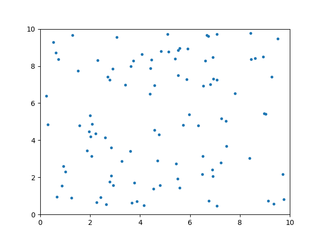
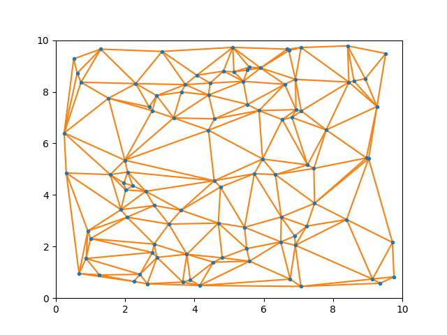
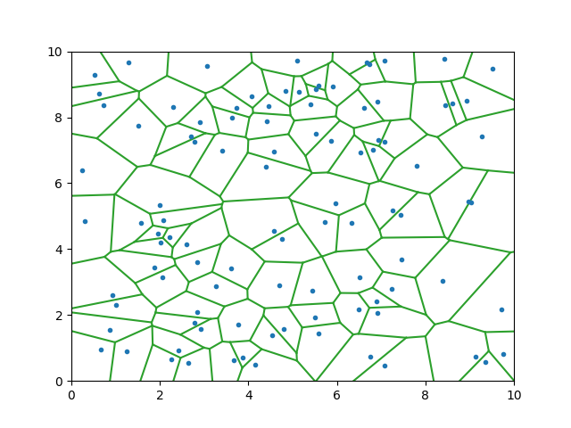

# delaunay_voronoi
[](https://github.com/psf/black)

Delaunay triangulation and Voronoi tessellation in Python.

2020, Xavier R. Hoffmann <xrhoffmann@gmail.com>

This repository is licensed under the MIT License.

## Basics

Given a set of points in an Euclidean 2D space, we compute the [Delaunay triangulation](https://en.wikipedia.org/wiki/Delaunay_triangulation) (DT)
using the [Bowyer-Watson algorithm](https://en.wikipedia.org/wiki/Bowyer%E2%80%93Watson_algorithm). 
We compute the [Voronoi tessellation](https://en.wikipedia.org/wiki/Voronoi_diagram) (VT) as 
the dual graph of the DT.

For clarity, we define the DT graph as a set of **vertices** connected by **edges**. On the 
other hand, the VT network is defined as a set of **nodes** connected by **links**, with 
additional **arrows** pointing outward.

We only use core Python. The examples use `matplotlib` for plotting.

Coordinates and distances are assumed Euclidean.

## Usage
* Initialize an instance of the `DelVor` class with the `x` and `y` coordinates.
```
from delaunayvoronoi import delvor

x = <my_x_coordinates>
y = <my_y_coordinates>
my_instance = delvor.DelVor(x=x, y=y)
```
* Compute the Delaunay triangluation. 
```
vertices, edges = my_instance.compute_delaunay()
```
This returns the original points (`vertices`)
and the connections between them (`edges`). 
* Compute the Voronoi tessellation.
```
nodes, links, arrows = my_instance.compute_voronoi()
```
This returns all the circumcenters (`nodes`),
the connections between them (`links`) and the lines that 
extends outwards towards infinity (`arrows`).
* Define limits of the bounding box and prepare elements for plotting. 
By default, the bounding box is constructed with a buffer of 1 unit around
the original points.
```
lower_left = (x_min, y_min)
upper_right = (x_max, y_max)
bounding_box = (lower_left, upper_right)
p_del, e_del, p_vor, e_vor = a.prepare_plot(bbox=bounding_box)
```
This returns all the vertices (`p_del`) and edges (`e_del`) of the
Delaunay triangulation and all the nodes (`p_vor`) and links (`e_vor`) of
the Voronoi tessellation. Outward pointing arrows are extended until
the bounding box.

## Representation
### vertices
- Vertices are labeled with a unique `vertex_label` from 0 to N-1 (in an arbitrary order).
- `vertices` is a dictionary where the keys are the vertex labels and
the values are 2-tuples with the coordinates in format `(x, y)`.
### edges
- Edges are identified by the two vertices that they connect, through
their labels.
- `edges` is a tuple of 2-tuples that have the format 
`(vertex_label1, vertex_label2)`.
### nodes
- Triangles are identified by the three vertices that they connect, with 
a 3-tuple of the form `(vertex_label1, vertex_label2, vertex_label2)`. 
- `nodes` is a dictionary where the keys are the triangle 3-tuples and
the values are 2-tuples with the coordinates of the circumcenter in 
format `(x, y)`.
### links
- Links are identified by the two circumcenters that they connect, through
their triangle 3-tuples.
- `links` is a tuple of 2-tuples that have the format `((A, B, C), (D, E, F))`
where `(A, B, C)` and `(D, E, F)` are triangle identifiers.
### arrows
- Arrows are identified by the circumcenter they emanate from and a
direction vector.
- `arrows` is a tuple of 2-tuples that have the format `(A, B, C), (w_x, w_y)`
where `(A, B, C)` is a triangle identifier and `(w_x, w_y)` the components
of the direction vector.
### plotting elements
- `p_del` contains tuples in format `(x, y)` which represent the points
of the Delaunay triangulation.
- `e_del` contains tuples in format `(x1, y1), (x2, y2)` which represent
the start point and end point of each edge of the Delaunay triangulation.
- `p_vor` contains tuples in format `(x, y)` which represent the points
of the Voronoi tessellation.
- `e_vor` contains tuples in format `(x1, y1), (x2, y2)` which represent
the start point and end point of each edge of the Voronoi tessellation
  (including the arrows that extend until the bounding box).
## Example
### Instan
```
from delaunayvoronoi.delvor import DelVor
import numpy as np
import matplotlib.pyplot as plt

np.random.seed(3)
n = 100
size = 10

# sample random points
x = size * np.random.random(n)
y = size * np.random.random(n)

# compute
my_instance = DelVor(x=x, y=y)
p_del, e_del, p_vor, e_vor = my_instance.prepare_plot()

# plot
plt.plot(x, y, '.', color="C0")
plt.xlim([0, size])
plt.ylim([0, size])
plt.savefig("./docs/points.png")
plt.show()
```

### Delaunay triangulation
```
for edge in e_del:
    plot_x, plot_y = zip(*edge)
    plt.plot(plot_x, plot_y, color="C1")
plot_x, plot_y = zip(*p_del)
plt.plot(plot_x, plot_y, '.', color="C0")
plt.xlim([0, size])
plt.ylim([0, size])
plt.savefig("./docs/delaunay.png")
plt.show()
```

### Voronoi tessellation
```
for edge in e_vor:
    plot_x, plot_y = zip(*edge)
    plt.plot(plot_x, plot_y, color="C2")
plot_x, plot_y = zip(*p_del)
plt.plot(plot_x, plot_y, '.', color="C0")
plt.xlim([0, size])
plt.ylim([0, size])
plt.savefig("./docs/voronoi.png")
plt.show()
```

